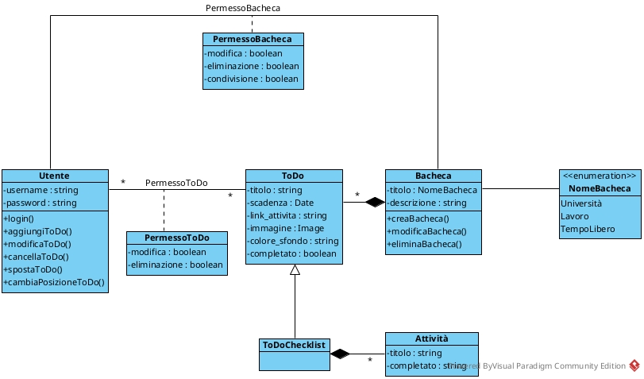

# Primo homework

## Analisi del dominio del progetto

Seguendo la traccia, abbiamo immaginato come debba funzionare l'interfaccia dell'applicazione, prendendo come spunto Trello.  
L'applicazione permetterà di modificare più bacheche e ogni bacheca conterrà più _to do_, ovvero schede promemoria con, facoltativamente, immagini, link, titolo e una lista di attività da completare come _checklist_.  
Ogni utente avrà le sue bacheche con relativi permessi di modifica e avrà la possibilità di condividerle con altri utenti e limitare i loro permessi.

## Individuazione delle classi

Le classi individuate sono:

- **model.Utente**: Questa classe contiene le informazioni legate ad un utente quali _username_ e _password_ e, attraverso i suoi metodi, gestisce le bacheche e i _to do_ al quale l'utente che rappresenta è associato.
- **model.ToDo**: La classe che rappresenta una scheda all'interno di una bacheca. Contiene tutte le informazioni facoltative di un promemoria e lo stato di completamento.
  - **model.ToDoChecklist**: Classe figlia di _ToDo_, rappresenta un promemoria composto da più attività. Lo stato di completamento dipende dallo stato di completamento delle Attività al quale e legato.
- **Attività**: La classe che rappresenta le attività di una _ToDoChecklist_, di cui fa parte, quindi ne è composizione.
- **model.Bacheca**: La classe rappresentate una bacheca ed è composta da _ToDo_. Si suddivide in tre tipi di bacheca (Puramente estetici) grazie all'_enumeration_ **NomeBacheca**.

L'utente è associato alle classi _ToDo_ e _Bacheca_ tramite delle classi associative che ne definiscono i permessi di modifica. Per esempio, un utente diverso dall'autore di una bacheca non avrà il permesso di eliminarla o condividerla.

- **model.PermessoToDo**: La classe che associa _Utente_ e _ToDo_. Un utente ha il permesso di modificare o eliminare un promemoria.
- **model.PermessoBacheca**: La classe che associa _Utente_ e _Bacheca_. Contiene i permessi di modifica, eliminazione e condivisione. Solo l'autore di una bacheca ha il permesso di eliminarla. Quando condivisa, l'autore può scegliere se dare i permessi di modifica o condivisione all'utente destinatario.
