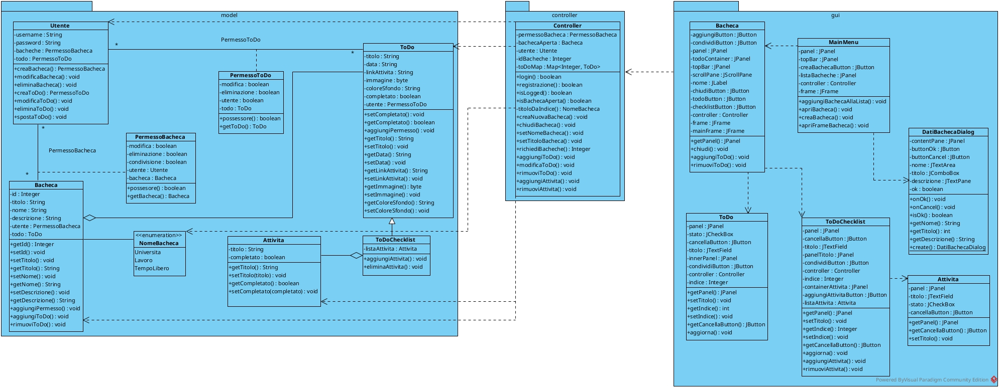

# Secondo homework

## Pacchetto `controller`

La classe `Controller` tiene in memoria la bacheca aperta, l'utente loggato
e i ToDo della bacheca, salvati in una *HashMap* con degli *Integer* come chiavi.  
  
I metodi di `Controller` permettono di modificare le classi del pacchetto `model`
dall'interfaccia e, in un'implementazione futura, gestirà le query al database.

## Pacchetto `gui`

Il pacchetto dell'interfaccia realizzato con Swing. Le finestre principali sono:
- `MainMenu`: La finestra che permette di aprire, eliminare e creare le bacheche;
  - Facendo uso della classe `DatiBachecaDialog` per richiedere i dati della nuova bacheca in input;
- `Bacheca`: La finestra che mostra la bacheca aperta in `Controller`.

Inoltre le classi `ToDo`, `ToDoChecklist` e `Attivita` sono componenti 
utilizzati da `Bacheca` per rappresentare le rispettive classi nel pacchetto `model`.